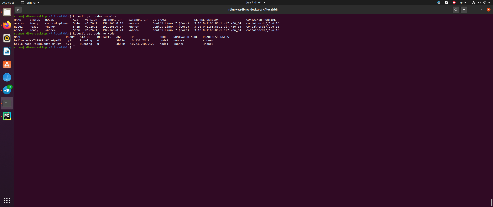
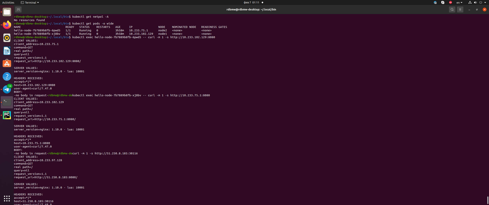
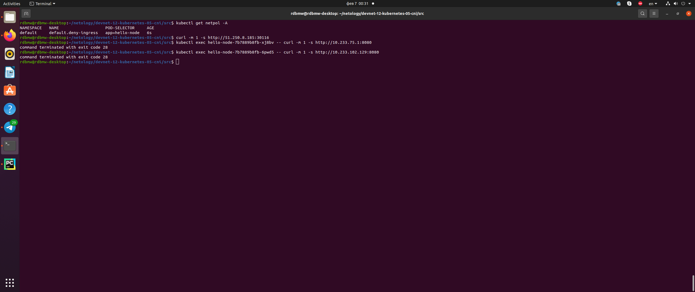
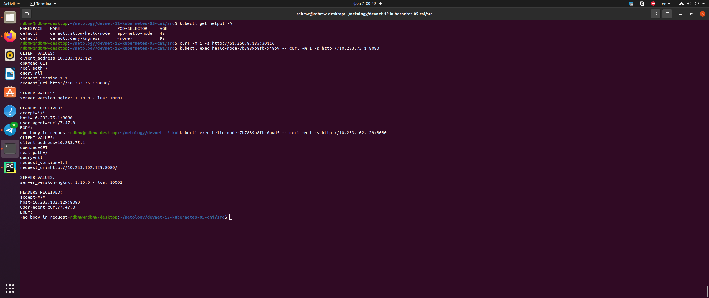
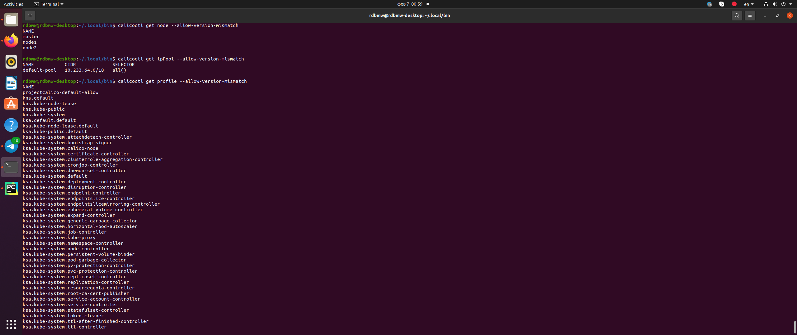

# Домашнее задание к занятию "12.5 Сетевые решения CNI"
После работы с Flannel появилась необходимость обеспечить безопасность для приложения. Для этого лучше всего подойдет Calico.


## Задание 1: установить в кластер CNI плагин Calico

### Вопрос 

Для проверки других сетевых решений стоит поставить отличный от Flannel плагин — например, Calico. Требования: 
* установка производится через ansible/kubespray;
* после применения следует настроить политику доступа к hello-world извне. Инструкции [kubernetes.io](https://kubernetes.io/docs/concepts/services-networking/network-policies/), [Calico](https://docs.projectcalico.org/about/about-network-policy)

### Ответ

Устанавливаем кластер через kubespray (1 мастер-нода, 2 воркер-ноды) и разворачиваем 2 пода с помощью [deployment.yaml](src/deployment.yaml):



Проверяем отсутствие политик и прохождение запросов внутри кластера и извне — все успешны:



В задании не описано как следует настроить политику доступа извне. Поэтому, для примера, сначала запретим входящий трафик, а потом разрешим входящий трафик внутри кластера.

Применяем политику [network-policy-default-deny-ingress.yaml](src/network-policy-default-deny-ingress.yaml). Проверяем прохождение запросов — запросы не проходят:



Применяем политику [network-policy-default-allow-hello-node.yaml](src/network-policy-default-allow-hello-node.yaml). Проверяем прохождение запросов внутри кластера — запросы проходят:



## Задание 2: изучить, что запущено по умолчанию

### Вопрос 

Самый простой способ — проверить командой calicoctl get <type>. Для проверки стоит получить список нод, ipPool и profile.
Требования: 
* установить утилиту calicoctl;
* получить 3 вышеописанных типа в консоли.

### Ответ

Устанавливаем утилиту:

```
rdbmw@rdbmw-desktop:~/.local/bin$ curl -L https://github.com/projectcalico/calico/releases/download/v3.25.0/calicoctl-linux-amd64 -o calicoctl
  % Total    % Received % Xferd  Average Speed   Time    Time     Time  Current
                                 Dload  Upload   Total   Spent    Left  Speed
  0     0    0     0    0     0      0      0 --:--:-- --:--:-- --:--:--     0
100 56.8M  100 56.8M    0     0  8161k      0  0:00:07  0:00:07 --:--:-- 10.9M
rdbmw@rdbmw-desktop:~/.local/bin$ chmod +x ./calicoctl
rdbmw@rdbmw-desktop:~/.local/bin$ calicoctl version
Client Version:    v3.25.0
Git commit:        3f7fe4d29
Cluster Version:   v3.24.5
Cluster Type:      kubespray,kubeadm,kdd
```

Получаем список нод, ipPool и profile:

